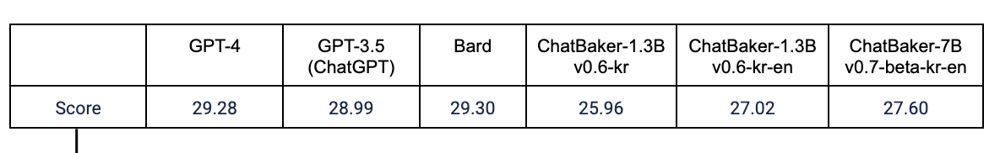

* [챗베이커 (ChatBaker)](#챗베이커-chatbaker)
  * [온라인 데모](#온라인-데모)
  * [생성형 언어 모델](#생성형-언어-모델)
    * 데이터셋, 한국어/영어 평가
  * [사전 학습 모델](#사전-학습-모델-plm)
    * 아키텍쳐, 데이터셋, 토크나이저, 한국어/영어 평가
    * [모델 공개](#모델-공개)
  * [한계점](#한계점)
  * [라이센스](#라이센스)
  * [유의사항](#유의사항)

# 챗베이커 (ChatBaker)

**챗베이커** (**ChatBaker**)는 [**42dot**](https://42dot.ai/)에서 자체 개발한 생성형 언어 모델로, 다음의 특징을 가지고 있습니다.
- 대한민국 기관 최초의 **한영통합 거대 언어 모델** (Large Language Model, LLM) 학습 [more](#사전-학습-모델-plm)
  - 한영통합 PLM 1.3B, 7B (+ 한국어 PLM 1.3B) 
- 한영통합 PLM을 기반으로 **생성형 언어 모델** 학습 [more](#생성형-언어-모델)
- 직접 구축한 (수집, 정제) 데이터, 자체 학습 인프라 사용

뿐만아니라, [[🤗한영통합 PLM 1.3B](허깅페이스 모델 페이지 링크)]을 공개했고, [[온라인 데모](#온라인-데모)]를 통해 챗베이커 (ChatBaker)를 직접 사용해 볼 수 있습니다.

### 온라인 데모
'한영통합 PLM 7B'에 SFT (Supervised Fine-Tuning)으로 학습한 [**ChatBaker를 경험해보세요!**](demolink)

[데모 샘플 GIF 추가]

## 생성형 언어 모델
챗베이커 (ChatBaker)는 [Vicuna](https://lmsys.org/blog/2023-03-30-vicuna/)의 베이스 코드인 [FastChat](https://github.com/lm-sys/FastChat)을 사용했고, 파라미터는 아래와 같습니다.

| Hyperparameter | Global Batch Size | Learning rate | Epochs | Max length | Weight decay | Warmup ratio |
| -- | -- | -- | -- | -- | -- | -- |
| ChatBaker | 16 | 2e-5 | 3/6/9 | 2,048 | 0 | 0.03 |

A100 80G GPU 8장을 학습에 사용했습니다.

| Model | ChatBaker-1.3B-kr | ChatBaker-1.3B-kr-en | ChatBaker-7B-kr-en |
| -- | -- | -- | -- |
| Training time | 9 hours | 20 hours | 48 hours |

### 학습 데이터셋

질문/요청 및 이에 대한 응답으로 이루어진 Single/Multi-turn 형태의 대화 데이터를 학습에 사용했습니다.
- 챗베이커 (ChatBaker)의 학습 데이터 관련 내용은 공개하지 않습니다. 대신, 다양한 한국어 ([evolve-instruct](https://github.com/lcw99/evolve-instruct), [ko-lima-vicuna](https://huggingface.co/datasets/changpt/ko-lima-vicuna), 등) 및 영어 ([ShareGPT](링크추가), [OpenAssistant](https://huggingface.co/datasets/OpenAssistant/oasst1), etc.)의 Single/Multi-turn 대화 데이터가 공개되어 있습니다.

### 평가
- 비교대상:
  - Polyglot-Ko-1.3B-SFT: [Polyglot-Ko-1.3B](https://huggingface.co/EleutherAI/polyglot-ko-1.3b) 모델에 ChatBaker와 동일한 데이터로 학습한 모델
  - [ChatGPT](https://chat.openai.com/): OpenAI가 공개한 생성형 언어 모델 서비스 (GPT-3.5: 175B, GPT-4: 모델 크기 필요)
  - [Bard](https://bard.google.com/): Google이 공개한 생성형 언어 모델 서비스 (137B)
- 평가 데이터셋:
[데이터셋 내용 추가]
- 평가 방법:
[평가 방법 추가]

#### 한국어 평가

[성능 그래프 대체]

#### 영어 평가

[성능 그래프 추가]

## 사전 학습 모델 (PLM)
### 아키텍쳐
Transformer decoder 기반의 [LLaMA](https://arxiv.org/abs/2302.13971) 아키텍쳐를 사용했고, 파라미터는 아래와 같습니다.

| Hyperparameter | Global Batch Size | Learning rate | Epochs | Max length | Weight decay |
| -- | -- | -- | -- | -- | -- |
| PLM | | | | 2,048 | |

| Hyperparameter | Layers | Attention heads | Hidden size |  |  |
| -- | -- | -- | -- | -- | -- |
| 1.3B | 24 | 32 | 2,048 | | |
| 7B | | | | | |

A100 80G GPU 256장 (8 GPUs * 32 Nodes)을 사용했습니다.

| Model | KO 1.3B | KOEN 1.3B | KOEN 7B |
| -- | -- | -- | -- |
| Training time | xx days | xx days | 30 days+ |

### 학습 데이터셋
- 한국어: 100B 토큰
- 영어: 1T 토큰

### 토크나이저
Byte-level BPE 토크나이저를 사용했고, 한국어와 한영통합 토크나이저는 PLM의 학습 데이터셋에서 각각 100만건의 문서를 샘플링해 학습했습니다.

### 평가
#### 한국어
- 비교대상:
  - [Polyglot-Ko](https://github.com/EleutherAI/polyglot): GPT-NeoX 프레임워크에서 한국어 213B 토큰 (863 GB)의 데이터셋으로 학습한 모델
  - [KoGPT2](https://github.com/SKT-AI/KoGPT2): GPT 아키텍쳐를 기반으로 40GB 이상의 한국어 데이터셋으로 학습한 모델
- 평가 데이터셋:
  - [KoBEST](https://huggingface.co/datasets/skt/kobest_v1)
  - HyperClova에서 평가한 데이터셋은?
- 지표: Macro F1

[성능 그래프 추가]

#### 영어
- 비교대상:
  - [OPT](OPT 링크): 
  - [MPT](MPT 링크): 
  - [LLaMA](LLaMA 링크): 
- 평가 데이터셋: 영어 Benchmarks 14종
    - anli, arc, boolq, hellaswag, openbookqa, piqa, record, rte, truthfulqa_mc, wic, winogrande

[성능 그래프 추가]

### 모델 공개

🤗[한영통합 PLM 1.3B](허깅페이스 링크)

## 한계점
다른 LLM과 마찬가지로 챗베이커 (ChatBaker)도 많은 한계를 가지고 있습니다.
- 언어 모델을 기반으로하는 생성형 모델은 '환각 (Hallucination)'이라는 근본적인 문제가 있습니다. 언어모델을 사용하는 챗베이커 (ChatBaker)도 이러한 환각 문제를 가지고 있고, 이를 해결하기 위해 개발을 진행 중입니다.
- 챗베이커 (ChatBaker) 학습 데이터를 자체적으로 구축했지만, 미처 포함하지 못한 질문-응답 케이스가 존재할 수 있기 때문에 기대하는 형태의 응답을 생성하지 못 할 수 있습니다. 이러한 케이스는 사용자 피드백을 통해 지속적으로 보완해 나갈 계획입니다.
- 생성형 언어 모델인 챗베이커 (ChatBaker)는 랜덤 샘플링 방식을 따르고 있습니다. 이로 인해, 동일한 입력에 대해 매번 다른 응답을 생성 할 수 있습니다. 또한, 사용자가 입력한 질문/요청인 프롬프트에 민감합니다. 예를 들어, 주어진 질문에 정확한 답변을 생성했더라도, 표현방식이 다른 동일한 질문/요청에 잘못된 응답을 생성 할 수 있습니다.
- 도덕, 인종, 문화, 성별, 나이, 지역 등에 대한 부적절한 질문 또는 요청에 대해 응답을 회피하도록 노력했습니다. 하지만, 저희가 파악하지 못한 탈옥 (jailbreak) 등의 방법에 의해 옳지 않거나 편향적인 응답이 만들어 질 수 있습니다.

## 라이센스
- 코드: SFT 학습에 사용한 본 레포의 코드는 [FastChat](https://github.com/lm-sys/FastChat)의 것으로, FastChat의 라이센스인 Apache License 2.0을 따릅니다.
- 데이터: 챗베이커 (ChatBaker) 학습에 ShareGPT를 포함한 ChatGPT의 데이터를 일부 사용했습니다. 해당 데이터에 대해서는 OpenAI에 의해 생성된 데이터의 [약관](https://openai.com/policies/terms-of-use)과 ShareGPT의 [Privacy Practices](https://chrome.google.com/webstore/detail/sharegpt-share-your-chatg/daiacboceoaocpibfodeljbdfacokfjb)를 따릅니다.
- **수정필요, 라이센스 추가** 모델&데모: 공개한 모델 (한영통합 PLM 1.3B)과 온라인 데모 (한영통합 SFT 7B)는 42dot의 R&D 결과물로서, 비상업적인 용도로만 사용 가능합니다.

## 유의사항
본 페이지를 통해 공개하는 모델 (PLM) 및 챗베이커 온라인 데모를 통해 생성한 응답은 42dot의 입장과 무관하며, 42dot은 응답 내용 및 이로인해 발생하는 문제에 대해 책임지지 않습니다.
