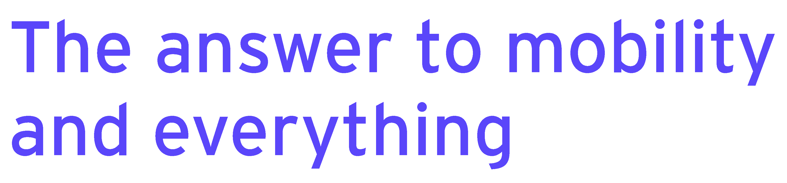
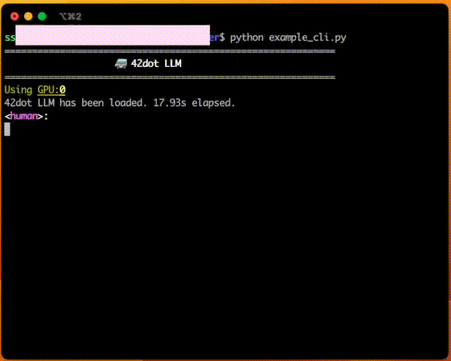

# 42dot LM

**42dot LM**은 [**포티투닷**](https://42dot.ai/) ([**42dot**](https://42dot.ai/))에서 자체 개발한 언어 모델들의 시리즈로, 다음의 특징을 가지고 있습니다.
- 대한민국 기관 최초의 **한영통합 언어 모델 (=42dot-PLM)** [more](#42dot-plm-사전-학습-모델)
- 42dot-PLM 기반의 **생성형 언어 모델 (=42dot-SFT)** [more](#42dot-sft-생성형-언어-모델)
- 직접 구축한 (수집, 정제) 데이터, 자체 학습 인프라 사용

뿐만 아니라, [🤗42dot-PLM 1.3B](허깅페이스 모델 페이지 링크)와 [🤗42dot-SFT 1.3B](허깅페이스 모델 페이지 링크)를 공개했습니다.


<figure align="center">

<figcaption><b>42dot-SFT의 [example_cli.py](#사용법) 실행 예제</b></figcaption>
</figure>

---

## 42dot-PLM (사전 학습 모델)
### 아키텍처
42dot-PLM은 [LLaMA 2](https://ai.meta.com/research/publications/llama-2-open-foundation-and-fine-tuned-chat-models/) 와 유사한 Transformer decoder 아키텍처를 사용했고, 모델 하이퍼파라미터는 아래와 같습니다.

| Params | Layers | Attention heads | Hidden size | FFN size |
| :-- | :--: | :--: | :--: | :--: |
| 1.3B | 24 | 32 | 2,048 | 5,632 |

학습 세팅은 아래와 같습니다.

| Params | Global batch size\* | Initial learning rate | Train iter.\* | Max length\* | Weight decay |
| :-- | :--: | :--: | :--: | :--: | :--: |
| 1.3B | 4.0M | 4e-4 | 1.0T | 2K | 0.1 |

(\* 단위: tokens)

### 학습

42dot-PLM의 학습은 A100 80G 256장을 사용했고, 학습에 소요된 시간은 아래와 같습니다.

| Model | 42dot-PLM |
| :-- | :--: |
| Time (approx.) | 6 days |


### 학습 데이터셋
42dot-PLM의 학습 데이터는 모두 웹 상에 공개된 데이터를 이용해 진행했고, 그 구성은 아래와 같습니다.
- 한국어: 약 100B 토큰
  - [직지 프로젝트](http://jikji.duckdns.org/), [mC4](https://huggingface.co/datasets/mc4), [LBox Open](https://github.com/lbox-kr/lbox-open), [KLUE](https://huggingface.co/datasets/klue), [위키피디아 (한국어)](https://ko.wikipedia.org/) 등 포함
- 영어: 약 1.3T 토큰
  - [The Pile](https://github.com/EleutherAI/the-pile), [RedPajama](https://github.com/togethercomputer/RedPajama-Data), [C4](https://huggingface.co/datasets/c4) 등 포함

### 토크나이저
Byte-level BPE 토크나이저를 사용했고, 학습 데이터셋에서 1,000만 건의 문서를 샘플링해 학습했습니다. Vocabulary 크기는 약 50K입니다.

### Zero-shot 성능 평가
42dot-PLM 및 비슷한 파라미터 크기의 타 PLM과의 성능을 비교하기 위해 한국어 및 영어 Zero-shot 벤치마크를 진행했고, 아래의 평가결과는 [lm-eval-harness](https://github.com/EleutherAI/lm-evaluation-harness/tree/polyglot)를 이용해 도출했습니다.
#### 한국어
- 비교대상:
  - [Polyglot-Ko 1.3B](https://github.com/EleutherAI/polyglot): [GPT-NeoX](https://github.com/EleutherAI/gpt-neox) 아키텍처로 한국어 213B 토큰 (863 GB)을 학습한 모델
  - [KoGPT2 1.2B](https://github.com/SKT-AI/KoGPT2): GPT 아키텍처로 40GB 이상의 한국어 데이터셋을 학습한 모델
  - [XGLM 1.7B](https://huggingface.co/facebook/xglm-1.7B): [GPT-3](https://arxiv.org/abs/2005.14165) 아키텍처로 한국어를 포함한 30개 국어, 500B 토큰을 학습한 모델
  - [PolyLM 1.7B](https://huggingface.co/DAMO-NLP-MT/polylm-1.7b): LLaMA 아키텍처로 한국어를 포함한 18개 국어, 640B 토큰을 학습한 모델
- 평가 데이터셋:
  - [KoBEST](https://huggingface.co/datasets/skt/kobest_v1): BoolQ, COPA, HellaSwag, SentiNeg 의 4개 태스크

<figure align="center">

<figcaption><b>42dot-PLM의 한국어 성능</b></figcaption>
</figure>

|Tasks / Macro-F1|[KoGPT2](https://github.com/SKT-AI/KoGPT2) <br>1.2B|[Polyglot-Ko](https://github.com/EleutherAI/polyglot) <br>1.3B|[XGLM](https://huggingface.co/facebook/xglm-1.7B) <br>1.7B|[PolyLM](https://huggingface.co/DAMO-NLP-MT/polylm-1.7b) <br>1.7B|42dot-PLM <br>1.3B|
|--------------|-----------|----------------|---------|-----------|------------------------|
|boolq         |0.337      |0.355           |**0.502**    |0.334      |0.424                   |
|copa          |0.67       |**0.721**           |0.616    |0.513      |0.698                   |
|hellaswag     |0.404      |0.401           |0.374    |0.321      |**0.438**                   |
|sentineg      |0.606      |0.679           |0.46     |0.382      |**0.74**                   |
|**average**       |0.504      |0.539           |0.488    |0.388      |**0.575**                   |
#### 영어
- 비교대상:
  - [OPT 1.3B](https://huggingface.co/facebook/opt-1.3b): GPT-3 아키텍처로 영어 300B 토큰을 학습한 모델
  - [MPT 1B](https://huggingface.co/mosaicml/mpt-1b-redpajama-200b): [MPT](https://www.mosaicml.com/blog/mpt-7b) 아키텍처로 RedPajama 데이터의 200B 토큰을 학습한 모델
  - XGLM 1.7B
  - PolyLM 1.7B

<figure align="center">

<figcaption><b>42dot-PLM의 영어 성능</b></figcaption>
</figure>


| Tasks / Metric         | MPT <br>1B | OPT <br>1.3B | XGLM <br>1.7B | PolyLM <br>1.7B | 42dot-PLM <br>1.3B |
| ---------------------- | ------ | -------- | --------- | ----------- | ------------------------ |
| anli_r1/acc            | 0.309  | **0.341**    | 0.334     | 0.336       | 0.303                    |
| anli_r2/acc            | 0.334  | **0.339**    | 0.331     | 0.314       | 0.337                    |
| anli_r3/acc            | 0.33   | 0.336    | 0.333     | **0.339**       | 0.328                    |
| arc_challenge/acc      | 0.268  | 0.234    | 0.21      | 0.198       | **0.287**                    |
| arc_challenge/acc_norm | 0.291  | 0.295    | 0.243     | 0.256       | **0.319**                     |
| arc_easy/acc           | 0.608  | 0.571    | 0.537     | 0.461       | **0.617**                    |
| arc_easy/acc_norm      | **0.555**  | 0.51     | 0.479     | 0.404       | 0.548                    |
| boolq/acc              | 0.517  | 0.578    | 0.585     | 0.617       | **0.62**                  |
| hellaswag/acc          | **0.415**  | **0.415**    | 0.362     | 0.322       | 0.412                    |
| hellaswag/acc_norm     | 0.532  | **0.537**    | 0.458     | 0.372       | 0.527                    |
| openbookqa/acc         | **0.238**  | 0.234    | 0.17      | 0.166       | 0.212                    |
| openbookqa/acc_norm    | **0.334**  | **0.334**    | 0.298     | **0.334**       | 0.328                    |
| piqa/acc               | 0.714  | **0.718**    | 0.697     | 0.667       | 0.711                    |
| piqa/acc_norm          | 0.72   | **0.724**    | 0.703     | 0.649       | 0.721                    |
| record/f1              | 0.84   | **0.857**    | 0.775     | 0.681       | 0.841                    |
| record/em              | 0.832  | **0.849**    | 0.769     | 0.674       | 0.834                    |
| rte/acc                | 0.541  | 0.523    | **0.559**     | 0.513       | 0.524                    |
| truthfulqa_mc/mc1      | 0.224  | 0.237    | 0.215     | **0.251**       | 0.247                    |
| truthfulqa_mc/mc2      | 0.387  | 0.386    | 0.373     | **0.428**       | 0.392                    |
| wic/acc                | 0.498  | **0.509**    | 0.503     | 0.5         | 0.502                    |
| winogrande/acc         | 0.574  | **0.595**    | 0.55      | 0.519       | 0.579                    |
| **avearge**                | 0.479  | 0.482    | 0.452     | 0.429       | **0.485**                    |


---

## 42dot-SFT (생성형 언어 모델)
42dot-SFT는 42dot-PLM에 SFT (Supervised Fine-Tuning)를 수행한 모델로, 학습을 위한 파라미터는 아래와 같습니다.

| Model | Global Batch Size | Learning rate | Epochs | Max length | Weight decay | Warmup ratio |
| :-- | :--: | :--: | :--: | :--: | :--: | :--: |
| 1.3B | 16 | 2e-5 | 3 | 2,048 | 0 | 0.03 |

A100 80G GPU 8장을 학습에 사용했습니다.

| Model | 42dot-SFT |
| :-- | :--: |
| Time (approx.) | 20 hours |

### 학습 데이터셋

질문/요청 및 이에 대한 응답으로 이루어진 Single/Multi-turn 형태의 대화 데이터를 학습에 사용했습니다.
- 42dot-SFT의 학습 데이터 관련 내용은 공개하지 않습니다. 대신, 이미 공개되어 있는 다양한 한국어 ([evolve-instruct](https://github.com/lcw99/evolve-instruct), [ko-lima-vicuna](https://huggingface.co/datasets/changpt/ko-lima-vicuna), 등) 및 영어 ([ShareGPT](https://sharegpt.com), [OpenAssistant](https://huggingface.co/datasets/OpenAssistant/oasst1), etc.)의 Single/Multi-turn 대화 데이터를 참고할 수 있습니다.

### 평가
- 비교대상:
  - [ChatGPT](https://chat.openai.com/): OpenAI가 공개한 생성형 언어 모델 서비스 (GPT-3.5 및 GPT-4)
  - [Bard](https://bard.google.com/): Google이 공개한 생성형 언어 모델 서비스
  - [KORani-v2-13B](https://huggingface.co/KRAFTON/KORani-v1-13B): LLaMA 13B을 한국어 데이터셋으로 파인튜닝한 모델

| Model | GPT-3.5 |  GPT-4   |   Bard   | KORani | 42dot-SFT |
| :-- |:-------:|:--------:|:--------:|:------:|:---------:|
| Params | Unknown | Unknown | Unknown |  13B   |   1.3B    |

- 평가 데이터셋:
  - 10가지의 카테고리에서 총 121개의 태스크로 구성했습니다. [dataset](eval/benchmark_set_v2.csv)
- 평가 방법:
  - GPT-4를 평가 수단으로 사용했고, <태스크, 질문, 응답>을 포함하는 [프롬프트](eval/eval_prompt.yaml)를 입력으로 6가지 항목에 대해 각 비교대상의 응답을 평가했습니다.

<figure align="center">

<figcaption><b>한국어 평가 데이터셋에 대한 응답 품질 평가</b></figcaption>
</figure>

<figure align="center">

<figcaption><b>상용 서비스와 42dot-SFT의 응답 비교</b></figcaption>
</figure>

---

### 모델 공개

- 🤗[42dot-PLM 1.3B](허깅페이스 링크)
- 🤗[42dot-SFT 1.3B](허깅페이스 링크)

---

## 사용법
본 리포지토리에는 간단한 생성 코드를 함께 제공하며, 아래 명령을 통해 관련 패키지를 설치하고 직접 모델을 구동해 볼 수 있습니다.

```bash
$ pip install -r requirements.txt
$ python example_cli.py
```

기본적으로 디바이스 설정을 자동으로 찾으며, CPU 또는 메모리 여유가 충분한 GPU를 자동으로 찾아 최적의 디바이스에서 동작하도록 설계되어 있습니다. 또한 `--device=cpu` 옵션으로 항상 CPU에서 구동할 수 있으며, 별도의 Quantization 옵션 없이도 M1 맥북 프로에서는 CPU 옵션으로 로컬 구동(약 4GB 정도 여유 메모리 필요)이 가능합니다. 이외에도 생성과 관련한 다양한 옵션을 지원하며 `--help`로 도움말을 확인할 수 있습니다.

```bash
$ python example_cli.py --help
```

---

## 한계점
다른 LLM과 마찬가지로 42dot LM도 여러 한계를 가지고 있습니다. 42dot LM를 활용할 때 이러한 한계점들을 감안하기 바랍니다.
- 언어 모델은 [환각 (Hallucination)](https://en.wikipedia.org/wiki/Hallucination_(artificial_intelligence))이라는 근본적인 문제가 있습니다. 마찬가지로 언어 모델인 42dot LM도 이러한 환각 문제를 가지고 있으며, 생성하는 내용이 사실과 일치하지 않을 수 있습니다.
- 자체적으로 42dot-SFT의 학습 데이터를 구축하면서 케이스를 최대한 다양화했지만, 미처 포함하지 못한 질문-응답 케이스가 존재할 수 있기 때문에 기대하는 형태의 응답을 생성하지 못할 수 있습니다. 
- 동일한 입력에 대해 매번 다른 응답을 생성할 수 있습니다. 또한, 사용자가 입력한 질문/요청인 프롬프트에 민감합니다. 예를 들어, 주어진 질문에 정확한 답변을 생성했더라도, 동일한 내용에 표현 방식만 다른 질문/요청에 전혀 다른 응답을 생성할 수 있습니다.
- 생성 결과에 별도의 필터링을 적용하지 않았습니다. 따라서 도덕, 인종, 문화, 성별, 나이, 지역, 종교, 정치성향 등에 대해 편향적이거나 부적절한 응답을 생성할 수 있습니다.

---

## 라이센스
- 데이터: 42dot-SFT 학습에 ShareGPT를 포함한 ChatGPT의 데이터를 일부 사용했습니다. 해당 데이터에 대해서는 OpenAI에 의해 생성된 데이터의 [약관](https://openai.com/policies/terms-of-use)과 ShareGPT의 [Privacy Practices](https://chrome.google.com/webstore/detail/sharegpt-share-your-chatg/daiacboceoaocpibfodeljbdfacokfjb)를 따릅니다.
- 모델: [공개한 모델](#모델-공개)은 42dot의 R&D 결과물로서, [Apache License 2.0](LICENSE)를 따릅니다.

---

## 유의사항
42dot LM을 통해 생성한 내용은 42dot의 입장과 무관하며, 42dot은 생성 내용 및 이로 인해 발생하는 문제에 대해 책임지지 않습니다.

---

## Citation

```
@misc{42dot2023lm,
      title={42dot LM: Instruction Tuned Large Language Model by 42dot},
      author={Woo-Jong Ryu and Sang-Kil Park and Jinwoo Park and Seongmin Lee and Yongkeun Hwang},
      year={2023},
      url = {https://gitlab.42dot.ai/NLP/hyperai/ChatBaker},
      version = {pre-release},
}
```
