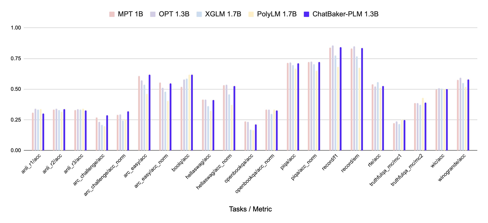

---
language:
- en
- ko
pipeline_tag: text-generation
inference: false
tags:
- pytorch
- llama
- causal-lm
license: apache-2.0
---
# ChatBaker-PLM 1.3B

**ChatBaker-PLM** is a pre-trained language model (PLM) developed by [**42dot**](https://42dot.ai/) which is trained using Korean and English text corpus. This repository contains a 1.3B-parameter version of the model.

## Model Description

### Hyperparameters
ChatBaker-PLM is built upon a Transformer decoder architecture similar to the [LLaMA 2](https://ai.meta.com/research/publications/llama-2-open-foundation-and-fine-tuned-chat-models/) and its hyperparameters are listed below.

| Params | Layers | Attention heads | Hidden size | FFN size |
| -- | -- | -- | -- | -- |
| 1.3B | 24 | 32 | 2,048 | 5,632 |

### Pre-training

Pre-training took 6 days using 256 * NVIDIA A100 GPUs. Related settings are listed below.

| Params | Global batch size\* | Initial learning rate | Train iter.\* | Max length\* | Weight decay |
| -- | -- | -- | -- | -- | -- |
| 1.3B | 4.0M | 4E-4 | 1.0T | 2K | 0.1 |

(\* unit: tokens)

### Pre-training datasets
We used a set of publicly available text corpus, including:
- Korean: about 100B tokens
  - [Jikji project](http://jikji.duckdns.org/), [mC4-ko](https://huggingface.co/datasets/mc4), [LBox Open](https://github.com/lbox-kr/lbox-open), [KLUE](https://huggingface.co/datasets/klue), [Wikipedia (Korean)](https://ko.wikipedia.org/) and so on.
- English: about 1.3T tokens
  - [The Pile](https://github.com/EleutherAI/the-pile), [RedPajama](https://github.com/togethercomputer/RedPajama-Data), [C4](https://huggingface.co/datasets/c4) and so on.

### Tokenizer
The tokenizer is based on Byte-level BPE algorithm. We trained its vocabulary from scratch using a subset of the pre-training corpus. For constructing subset, 10M and 10M documents are sampled from Korean and English corpus respectively. The resulting vocabulary sizes about 50K.

### Zero-shot evaluations
We evaluate ChatBaker-PLM on a variety of academic benchmarks both on Korean and English. All the results are obtained using [lm-eval-harness](https://github.com/EleutherAI/lm-evaluation-harness/tree/polyglot) and models released on the Hugging Face Hub. 
#### Korean (KOBEST)

<figure align="center">

</figure>

|Tasks / Macro-F1|[KoGPT2](https://github.com/SKT-AI/KoGPT2) <br>1.2B|[Polyglot-Ko](https://github.com/EleutherAI/polyglot) <br>1.3B|[XGLM](https://huggingface.co/facebook/xglm-1.7B) <br>1.7B|[PolyLM](https://huggingface.co/DAMO-NLP-MT/polylm-1.7b) <br>1.7B|ChatBaker-PLM <br>1.3B ko-en|
|--------------|-----------|----------------|---------|-----------|------------------------|
|boolq         |0.337      |0.355           |**0.502**    |0.334      |0.424                   |
|copa          |0.67       |**0.721**           |0.616    |0.513      |0.698                   |
|hellaswag     |0.404      |0.401           |0.374    |0.321      |**0.438**                   |
|sentineg      |0.606      |0.679           |0.46     |0.382      |**0.74**                   |
|wic           |0.328      |0.328           |0.328    |0.328      |0.328                   |
|**average**       |0.469      |0.497           |0.456    |0.376      |**0.526**                   |


#### English

<figure align="center">

</figure>

| Tasks / Metric         | [MPT](https://huggingface.co/mosaicml/mpt-1b-redpajama-200b) <br>1B | [OPT](https://huggingface.co/facebook/opt-1.3b) <br>1.3B | XGLM <br>1.7B | PolyLM <br>1.7B | ChatBaker-PLM <br>1.3B ko-en |
| ---------------------- | ------ | -------- | --------- | ----------- | ------------------------ |
| anli_r1/acc            | 0.309  | **0.341**    | 0.334     | 0.336       | 0.303                    |
| anli_r2/acc            | 0.334  | **0.339**    | 0.331     | 0.314       | 0.337                    |
| anli_r3/acc            | 0.33   | 0.336    | 0.333     | **0.339**       | 0.328                    |
| arc_challenge/acc      | 0.268  | 0.234    | 0.21      | 0.198       | **0.287**                    |
| arc_challenge/acc_norm | 0.291  | 0.295    | 0.243     | 0.256       | **0.319**                     |
| arc_easy/acc           | 0.608  | 0.571    | 0.537     | 0.461       | **0.617**                    |
| arc_easy/acc_norm      | **0.555**  | 0.51     | 0.479     | 0.404       | 0.548                    |
| boolq/acc              | 0.517  | 0.578    | 0.585     | 0.617       | **0.62**                  |
| hellaswag/acc          | **0.415**  | **0.415**    | 0.362     | 0.322       | 0.412                    |
| hellaswag/acc_norm     | 0.532  | **0.537**    | 0.458     | 0.372       | 0.527                    |
| openbookqa/acc         | **0.238**  | 0.234    | 0.17      | 0.166       | 0.212                    |
| openbookqa/acc_norm    | **0.334**  | **0.334**    | 0.298     | **0.334**       | 0.328                    |
| piqa/acc               | 0.714  | **0.718**    | 0.697     | 0.667       | 0.711                    |
| piqa/acc_norm          | 0.72   | **0.724**    | 0.703     | 0.649       | 0.721                    |
| record/f1              | 0.84   | **0.857**    | 0.775     | 0.681       | 0.841                    |
| record/em              | 0.832  | **0.849**    | 0.769     | 0.674       | 0.834                    |
| rte/acc                | 0.541  | 0.523    | **0.559**     | 0.513       | 0.524                    |
| truthfulqa_mc/mc1      | 0.224  | 0.237    | 0.215     | **0.251**       | 0.247                    |
| truthfulqa_mc/mc2      | 0.387  | 0.386    | 0.373     | **0.428**       | 0.392                    |
| wic/acc                | 0.498  | **0.509**    | 0.503     | 0.5         | 0.502                    |
| winogrande/acc         | 0.574  | **0.595**    | 0.55      | 0.519       | 0.579                    |
| **avearge**                | 0.479  | 0.482    | 0.452     | 0.429       | **0.485**                    |

## Limitations and Ethical Considerations
ChatBaker-PLM shares a number of well-known limitations of other large language models (LLMs). For example, it may generate false and misinformative contents since ChatBaker-PLM is also subject to [hallucination](https://en.wikipedia.org/wiki/Hallucination_(artificial_intelligence)). In addition, ChatBaker-PLM may generate toxic, harmful and biased contents due to use of web-available training corpus. We strongly suggest that ChatBaker-PLM users should beware of those limitations and take necessary steps for mitigating those issues.

## Disclaimer
The contents generated by ChatBaker series models ("ChatBaker models") do not necessarily reflect the views or opinions of 42dot Inc. ("42dot"). 42dot disclaims any and all liability to any part for any direct, indirect, implied, punitive, special, incidental or other consequential damages arising any use of the ChatBaker models and theirs generated contents.

## License
The ChatBaker-PLM is licensed under the Apache License, Version 2.0.

## Citation

```
@misc{42dot2023chatbaker,
      title={ChatBaker: Instruction Tuned Large Language Model of 42dot},
      author={Woo-Jong Ryu and SangKil Park and Jinwoo Park and Sungmin Lee and Yongkeun Hwang},
      year={2023},
      url = {https://gitlab.42dot.ai/NLP/hyperai/ChatBaker},
      version = {pre-release},
}
```
